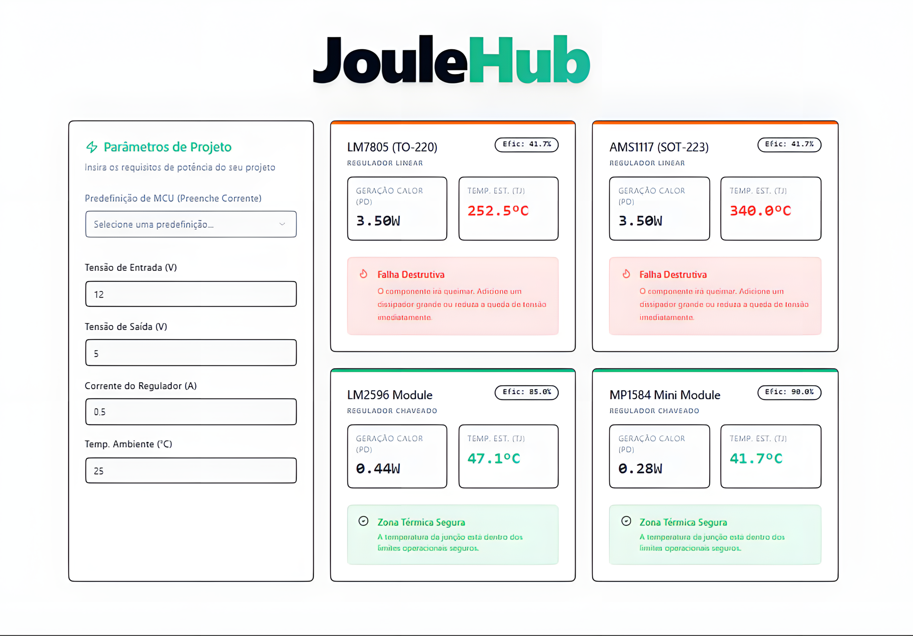

# JouleHub

**Access the live platform:** [https://gabriel-re-pires.github.io/JouleHub/](https://gabriel-re-pires.github.io/JouleHub/)

Web platform developed to assist in hardware design and prototyping, focusing on thermal and power analysis of linear and switching voltage regulators.

It allows you to validate the feasibility of the power supply, preventing failures and risks of deformation in enclosures, such as 3D printed PLA or PETG cases.

## Features

* Calculation of Heat Generation (Pd) and Junction Temperature (Tj).
* Built-in current consumption presets for various common microcontrollers on the market.
* Real-time safety alerts for Safe Thermal Zones and Destructive Failures.

## Technologies Used

* Next.js (version 14.2.3).
* TypeScript.

